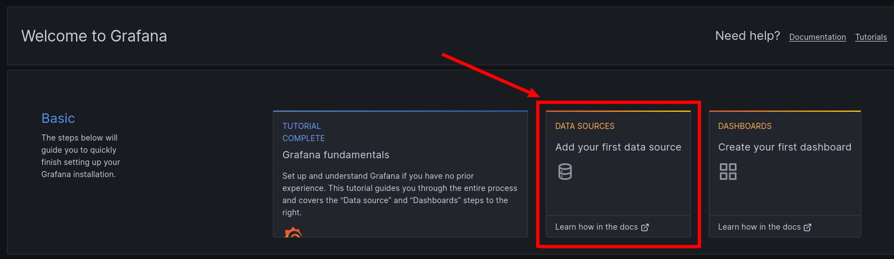
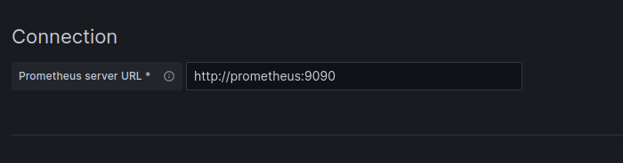
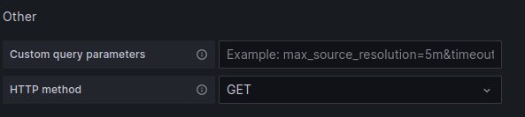
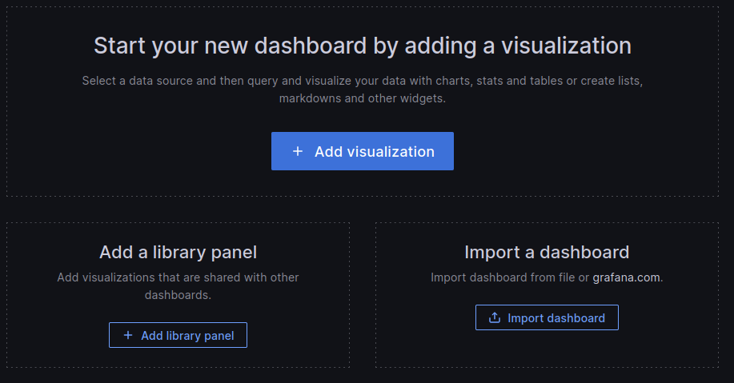
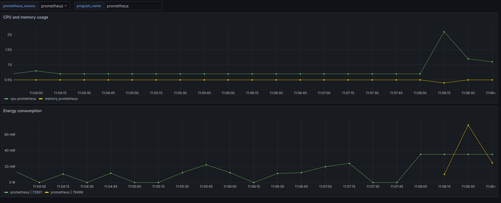

# GreenIT project

This project aim to help developpers to reduce energy consumption of there programs. It's working with Scaphandre, Prometheus and Grafana. 

## Requirements

Make sure you have makefile, docker and docker-compose installed on our computer and check if your computer have the requierements for scaphandre :
https://hubblo-org.github.io/scaphandre-documentation/compatibility.html

## How to use
Run "make" at the root of the project, it should start all containers. Then go to "http://localhost:3000". You should find the grafana login page. Enter admin for username and admin for password.

After setting up a new password, create a new visualisation. Choose "prometheus" for the data type.

In prometheus data source configuration pannel, enter "http://localhost:9090" for prometheus server url.

Finally, choose "GET" for Http method at the bottom of the page.

You can now click on "Save and Test". A confirmation message should appear if everything worked. Click on "build a dashbord" in the confimation message.

Click on "Import dashboard" and select the dashboard inside the dashboards folder of this repository named "greenIT_dashboard.json".

Congratulation, everything is setup. ! By default you can see the data of prometheus but you can change it with the "program_name". For the moment it's a little tricky but changing the program_name only change the energy consumption panel. For cpu and memory panel send this request with "your_program_name" replaced:

curl -X POST http://localhost:5001/program  -H "Content-Type: application/json" -d "{\"name\":\"your_program_name\"}"

## Common issues

If grafana failed because of permission denied, check docker-compose/grafana/volume right access.

For any other issue, please create a new github issue.